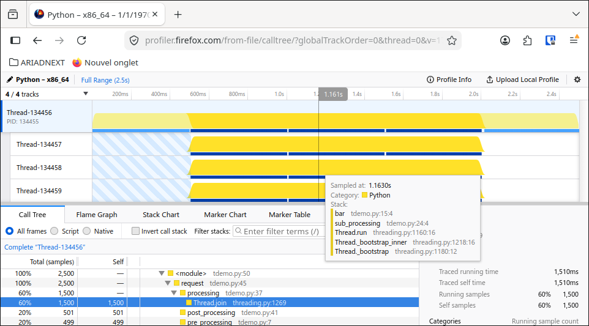
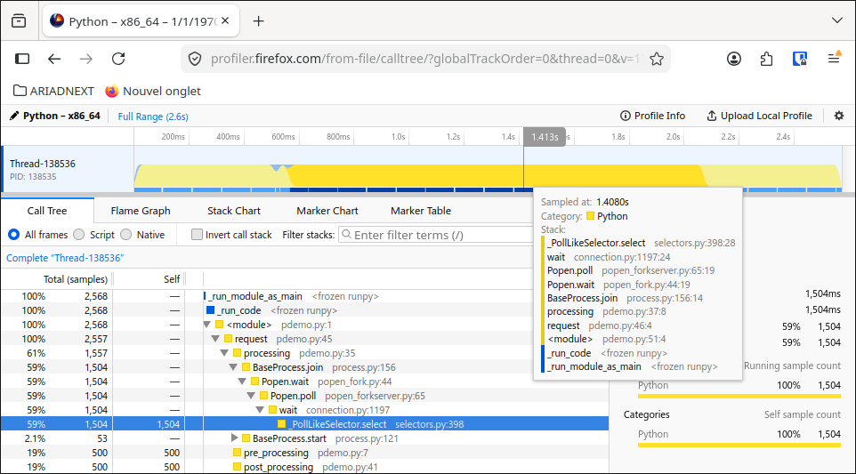
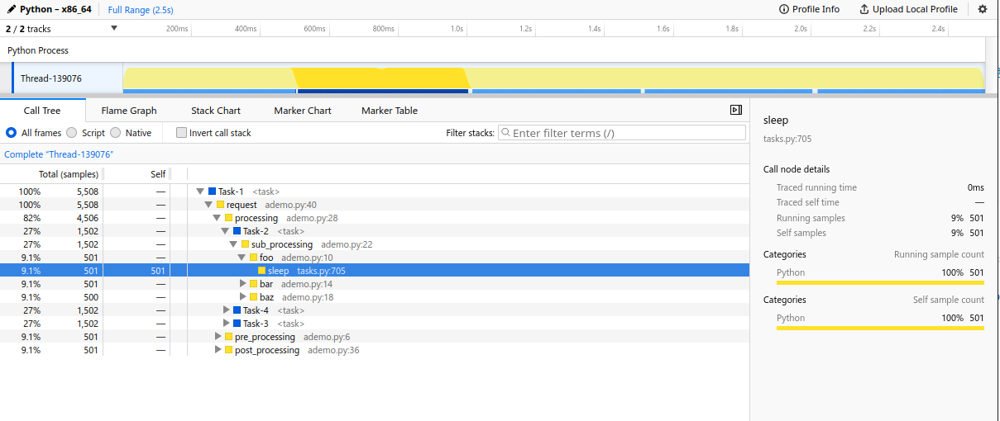

# Tachyon as a timeline profiler

Create environment (one-time):

```bash
$ sudo apt-get install libzstd-dev
$ pyenv install 3.15.dev
```

Activate environemnt:

```bash
$ pyenv shell 3.15.dev
$ python -c "import sys; print(sys.version)"
3.15.0b3+dev (heads/3.15:9fcebd3, Jul 16 2026, 13:57:38) [GCC 11.4.0]

```

## Threads

The timeline for threads:

```bash
$ python -m profiling.sampling run --gecko -o outputs/tdemo.json --all-threads  scripts/tdemo.py
```



is as expected:

```
Time (s)  0.0         0.5         1.0         1.5         2.0         2.5
          |           |           |           |           |           |
Main      [                         request                          ]
          [ pre_proc ][            processing            ][post_proc ]

Thread-1              [          sub_processing          ]
                      [   foo    ][   bar    ][   baz    ]

Thread-2              [          sub_processing          ]
                      [   foo    ][   bar    ][   baz    ]

Thread-3              [          sub_processing          ]
                      [   foo    ][   bar    ][   baz    ]
```


## Processes

The timeline for processes:

```bash
python -m profiling.sampling run --gecko -o outputs/pdemo.json --subprocesses scripts/pdemo.py
```



is one-line, I would expect:

```
Time (s)  0.0         0.5         1.0         1.5         2.0         2.5
          |           |           |           |           |           |
Main      [                         request                          ]
          [ pre_proc ][            processing            ][post_proc ]

Process-1             [          sub_processing          ]
                      [   foo    ][   bar    ][   baz    ]

Process-2             [          sub_processing          ]
                      [   foo    ][   bar    ][   baz    ]

Process-3             [          sub_processing          ]
                      [   foo    ][   bar    ][   baz    ]
```

## Asyncio Tasks

The timeline for asyncio tasks:

```bash
python -m profiling.sampling run --gecko -o outputs/ademo.json --async-aware --async-mode=all  scripts/ademo.py
```



I would expected:

```
Time (s)  0.0         0.5         1.0         1.5         2.0         2.5
          |           |           |           |           |           |
Main      [                         request                          ]
          [ pre_proc ][            processing            ][post_proc ]

Task-1                [          sub_processing          ]
                      [   foo    ][   bar    ][   baz    ]

Task-2                [          sub_processing          ]
                      [   foo    ][   bar    ][   baz    ]

Task-3                [          sub_processing          ]
                      [   foo    ][   bar    ][   baz    ]
```
